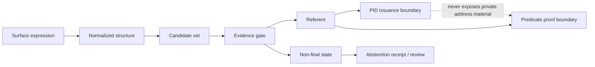

# Formal Core, Axioms, and Verification Map

This chapter is the compact formal core of Address Morphism Theory (AMT). It
collects the definitions, axioms, morphism chain, equivalence classes, history
graph semantics, unresolved-state semantics, PID issuance boundary,
zero-knowledge boundary, counterexamples, verification map, and benchmark
method in one place.

AMT is not a claim that all places are already known. It is a disciplined way
to say what an address resolver may emit, what it must refuse to emit, and how
future evidence changes the state without pretending that uncertainty vanished.

## Core Objects

Let the following sets be fixed within a deployment scope `D`.

- `S`: surface address expressions, including text, structured form fields,
  codes, names, route hints, or machine envelopes.
- `N`: normalized address structures.
- `E`: evidence states. An evidence state contains source versions, authority
  class, observation time, quality scores, hard-error flags, and source lineage.
- `C_e(s)`: candidate set generated from surface expression `s` under evidence
  state `e`.
- `R`: typed referents. A referent can be a building, entrance, unit, handoff
  point, administrative unit, routeable region, natural feature, cultural
  place, virtual town, or institutional delivery object.
- `K`: contexts or purposes, such as registration, delivery, identity,
  emergency response, hotel check-in, POS handoff, or research indexing.
- `Q`: quality states. The minimal public states are `verified`, `partial`,
  and `manual_required`.
- `F`: non-final states. AMT treats non-finality as a semantic output, not as
  an implementation crash.

The central resolver is a partial, context-indexed morphism:

```text
rho_{k,e}: S -> R + F
```

If `rho_{k,e}(s) in R`, the resolver may emit a referent-level result. If
`rho_{k,e}(s) in F`, the resolver must emit a structured non-final state and
must not invent a precise referent or PID.

## Non-Final State Lattice

AMT uses an ordered family of non-final states:

```text
unresolved < partial < conditional
ambiguous  < manual_required
rejected   < blocked
deprecated < successor_required
disputed   < policy_dependent
```

The ordering is not a quality ranking. It is a control-flow ordering. A state
higher in the lattice needs either more evidence, human review, a policy
decision, a successor relation, or a new source version before precise
identifier issuance can occur.

## Axioms

### Axiom A1: Partiality

An address resolver is not a total function from surface expression to
referent. There exist `s in S` and `e in E` such that `rho_{k,e}(s) in F`.

### Axiom A2: Evidence Binding

Every emitted referent or non-final state is bound to an evidence state:

```text
emit(rho_{k,e}(s)) => includes(source_set_version(e), gate_version(e))
```

This prevents a result from being reviewed without knowing which source
versions and gates produced it.

### Axiom A3: Candidate Sufficiency Is Scoped

If a resolver emits `r in R`, it claims only that `r` is selected from
`C_e(s)` under scope `D`, not that all possible real-world objects have been
globally enumerated.

### Axiom A4: Non-Injectivity Safety

If two or more distinct candidates remain plausible within the tie policy,
then precise identifier issuance is forbidden:

```text
exists r1 != r2 in C_e(s), near(r1, r2, k, e) => rho_{k,e}(s) = ambiguous
```

### Axiom A5: Hard-Error Dominance

Hard validation errors dominate score aggregation:

```text
hard_error(e, r) => r cannot be PID-issued
```

A high confidence score cannot override a source contradiction, forbidden
jurisdictional mismatch, revoked source, or known invalid lineage.

### Axiom A6: Context Relativity

The best referent can depend on context:

```text
rho_{delivery,e}(s) != rho_{emergency,e}(s)
```

For example, a delivery entrance, visitor entrance, emergency gate, and
administrative office can all be valid referents for the same surface label
under different purposes.

### Axiom A7: History Is Relational

Address history is a graph relation, not a single successor function. Split,
merge, rename, deprecation, and administrative transfer events must be
representable without losing continuity:

```text
H subset R x Event x R
```

### Axiom A8: PID Issuance Boundary

A PID may be issued only for a final referent whose candidate selection,
quality gate, lineage state, and source policy all pass under the declared
scope. Non-final states may receive receipts or review IDs, but not final PIDs.

### Axiom A9: ZK Non-Correction

Zero-knowledge proofs can hide and verify predicates over AMT-compatible
commitments. They cannot repair missing candidates, incorrect source lineage,
bad evidence gates, or a wrong referent selection.

### Axiom A10: Benchmark Reproducibility

Every benchmark claim must name its region, use case, source policy, fixture
type, metrics, failure behavior, and publication-safety boundary.

## Morphism Chain

The AMT chain is:

```text
surface expression
  -> observation
  -> normalization
  -> candidate generation
  -> evidence gate
  -> context-relative selection
  -> referent or non-final state
  -> PID boundary
  -> optional predicate proof boundary
```

The following commutative diagram is the intended safety condition:



The diagram does not say the chain always reaches `R`. Its main point is that
the proof boundary and PID boundary are downstream of candidate generation and
evidence gates.

## Equivalence Classes

AMT distinguishes at least four equivalence relations.

### Observational Equivalence

Two surface expressions are observationally equivalent under evidence state
`e` if they generate the same candidate set:

```text
s1 ~_obs,e s2 iff C_e(s1) = C_e(s2)
```

This equivalence is useful for search and normalization, but is too weak for
PID issuance.

### Institutional Equivalence

Two referents are institutionally equivalent under authority `a` if the
authority treats them as the same registrable object for purpose `k`.

This equivalence can change when administrative boundaries, building records,
or legal registries change.

### Operational Equivalence

Two referents are operationally equivalent under context `k` if a workflow can
use either without changing the outcome. A loading dock and a public entrance
are usually not operationally equivalent for delivery.

### Predicate Equivalence

Two referents are predicate-equivalent for a verifier policy `pi` if they
satisfy the same public predicates:

```text
r1 ~_pi r2 iff forall p in pi.public_predicates, p(r1) = p(r2)
```

This is the equivalence relation most relevant to ZK proofs. It is intentionally
coarser than PID identity.

## History Graph

The history graph is:

```text
H = (V, A)
V = referents, aliases, source states, and issued identifiers
A = versioned events
```

Required edge types include:

- `created`
- `renamed`
- `split_into`
- `merged_into`
- `deprecated_by`
- `transferred_to`
- `source_replaced_by`
- `pid_successor`

History safety requires:

1. no event may silently delete a prior referent;
2. a deprecated PID must point to either a successor, a review state, or a
   tombstone reason;
3. split and merge events must remain relational;
4. reconstruction must name its source version and cutoff time.

## Unresolved State Discipline

`unresolved` means the candidate generator or evidence gate cannot responsibly
support a referent. It does not mean the place does not exist.

AMT requires unresolved states to include:

- `reason_code`
- `source_set_version`
- `missing_evidence_class`
- `suggested_next_evidence`
- `safe_output_level`

The resolver may emit an alias, receipt, coarse region, or review request. It
must not emit a final PID unless new evidence moves the state through the
quality gate.

## PID Issuance Boundary

A PID is a durable referent identifier. It is not a formatted address, not a
proof, not a postal code, and not a private address record.

PID issuance requires:

1. final referent selection;
2. non-singleton ambiguity eliminated under the declared context;
3. hard-error count equal to zero;
4. source lineage recorded;
5. history graph state not deprecated or successor-required;
6. quality state at or above the deployment threshold;
7. publication-safe output with no private address material.

If any condition fails, the system can issue a receipt for review, but not a
final PID.

## Boundary With Zero-Knowledge Address Predicates

ZK Address Predicates depends on AMT. It proves statements over AMT-compatible
commitments and verifier policies:

```text
within(delivery_zone)
quality >= verified
freshness <= policy_window
not_revoked == true
consent_scope == purpose
```

ZK does not:

- generate candidates;
- decide whether a surface expression is correctly resolved;
- fix bad source data;
- make singleton predicate sets private;
- replace external cryptographic audit.

The safe contract is:

```text
AMT envelope -> predicate request -> proof bundle -> verifier decision
```

The envelope must never expose private address material in public signals.

## Counterexample Catalogue

AMT keeps counterexamples as first-class regression tests.

| Counterexample | Failure if ignored | AMT response |
| --- | --- | --- |
| Normalization collision | two different referents share one normalized label | return `ambiguous` |
| Candidate omission | true referent absent from candidate set | return `unresolved` or scoped claim |
| Stale authority | old source conflicts with current source | block PID or require successor |
| Split region | one historic referent becomes many | use relational history graph |
| Merge region | many historic referents become one | preserve prior references and successor edges |
| Context conflict | delivery and emergency need different entrances | context-indexed morphism |
| Singleton proof set | proof reveals the referent by uniqueness | block or coarsen predicate |
| No-postcode region | postal validation cannot anchor identity | use AGID-first region evidence |
| Disputed source | authorities disagree | policy-dependent state, not false certainty |
| Natural feature | no building or street exists | typed non-building referent |

## Verification Map

| Claim | Artifact | Verification type |
| --- | --- | --- |
| Resolver partiality | Axiom A1, chapter model | formal + executable-model |
| Ambiguity blocks PID | Axiom A4, counterexample tests | executable-model |
| Hard errors dominate score | Axiom A5, gate tests | executable-model |
| History graph is relational | Axiom A7, graph tests | executable-model |
| PID boundary blocks non-final states | Axiom A8, issuance tests | executable-model |
| ZK cannot fix bad resolution | Axiom A9, ZK boundary tests | formal + executable-model |
| Global candidate completeness | region fixture campaigns | empirical-target |
| Commercial verifier superiority | controlled comparison protocol | empirical-target |
| Cryptographic proof security | audited circuit implementation | out-of-scope for AMT alone |

## Benchmark Method

Benchmarks must be purpose-specific. A single global accuracy number is not
scientifically meaningful.

A benchmark pack must define:

1. `region`: country, territory, city, island, sea region, natural feature set,
   or postal-equivalent zone.
2. `use_case`: registration, delivery, hotel, POS, identity, emergency, map
   search, postal-zone design, or ZK predicate verification.
3. `source_policy`: official, open map, carrier, local authority, community,
   synthetic, or mixed.
4. `fixture_type`: synthetic, public institutional, aggregated, redacted, or
   source-derived with license review.
5. `metrics`: candidate recall, false PID issuance rate, abstention precision,
   ambiguity precision, lineage correctness, quality calibration, privacy
   leakage risk, latency, and reproducibility.
6. `failure_behavior`: unresolved, ambiguous, rejected, manual_required,
   successor_required, or policy_dependent.

The most important negative metric is false precise issuance. A resolver that
abstains too often can be improved. A resolver that confidently emits false
PIDs corrupts the reference graph.

## Executable Model

- Model: [07-formal-core-axioms-and-verification.model.py](models/07-formal-core-axioms-and-verification.model.py)
- Fixture: [07-formal-core-axioms-and-verification.model-tests.json](models/07-formal-core-axioms-and-verification.model-tests.json)

The model is a small local witness for the chapter's boundaries. It is not a
global dataset, production resolver, or audited cryptographic circuit.
