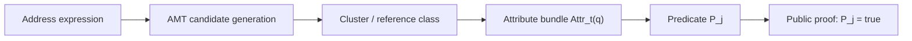
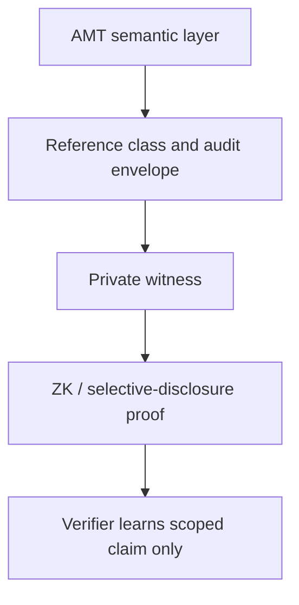
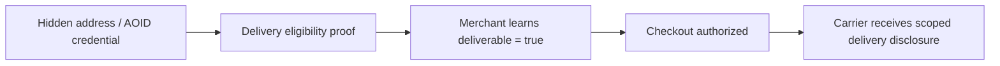
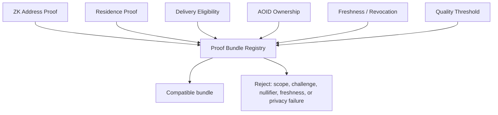

# 住所写像論に基づくゼロ知識住所証明

## 秘匿された住所参照から居住・配送可能性・所有・監査属性を証明するための基礎理論

Version: manuscript draft v0.2  
Date: 2026-06-06  
Author: to be supplied

## 要旨

住所は、個人の生活圏、世帯、建物、部屋、移動履歴、購買行動、配送可能性、行政所属を強く示す情報である。多くのサービスは、実際には「住所そのもの」ではなく、「ある国に居住している」「配送可能地域内である」「同一住所の居住者である」「住所資格証明が失効していない」「このPIDは正規の住所解決手順で発行された」といった限定された属性だけを必要とする。それにもかかわらず、従来の住所確認では、完全な住所、氏名、電話番号、部屋番号、緯度経度、配送指示が早い段階で開示されることが多い。

本論文は、住所写像論(Address Morphism Theory, AMT)を基礎として、住所を秘匿したまま住所由来の属性だけを証明する「ゼロ知識住所証明」の理論モデルを提案する。AMTは、曖昧で多言語・時間依存・文脈依存の住所表現を、候補生成、クラスタ形成、未解決判定、履歴更新、PID発行、品質評価によって参照クラスへ写像する意味論的理論である。本論文では、その参照クラスと属性束を秘密 witness とし、公開される述語だけを証明する暗号プロトコルの設計原理を与える。

本論文の中心的な分離は、意味論的正しさと暗号学的正しさの分離である。AMTは「何を住所として参照しているのか」「その参照はどの根拠で有効か」を与える。一方、ゼロ知識証明または選択的開示Credentialは「その参照からどの属性だけを公開するか」を制御する。暗号学的に正しい証明でも、住所述語の意味が不明確なら実用上は無意味である。逆に、AMTが正しい参照モデルを与えても、それだけではゼロ知識性は得られない。

本論文は、ZK Address Proof、ZK Residence Proof、ZK Delivery Eligibility、Same Address Resident Proof、AOID Ownership Proof、Duplicate Nullifier Proof、PID Issuance Audit Proof、Freshness and Revocation Proof、Consent and Purpose Scope Proof、Anonymous Rate Limit Proof、PID Merge/Split Legitimacy Proof、Quality Threshold Proofを体系化する。また、これらを組み合わせるProof Bundle Registryと互換性条件を定義し、スコープ衝突、nullifier再利用、失効漏れ、過度に狭い述語による再識別を防ぐための検証規則を示す。

本稿の主張は条件付きである。ここでいう「ゼロ知識住所証明」は、住所写像論に基づく証明関係とプロトコル設計の理論であり、実運用で完全なゼロ知識性を主張するには、監査済み回路、証明システム、Credential実装、失効機構、匿名集合評価、メタデータ漏洩監査が必要である。

## キーワード

住所写像論、ゼロ知識証明、住所秘匿、居住証明、配送可能性、AOID、AGID、PID、Credential、nullifier、失効、鮮度、匿名集合、Proof Bundle、住所監査。

## 目次

1. 問題設定  
2. AMT本体との境界  
3. 非主張と信頼境界  
4. 数理的準備  
5. AMTエンベロープと秘密witness  
6. ゼロ知識住所証明の主関係  
7. 可換図式  
8. 証明ファミリ  
9. CredentialとIssuer Trust  
10. Proof Bundle Registry  
11. 互換性、衝突、リンク不能性  
12. 定理、補題、反例  
13. 配送可能性の秘匿証明プロトコル  
14. Identity連携  
15. 検証方法  
16. 実装境界と今後の回路化  
17. セキュリティと濫用分析  
18. 限界  
19. 結論  
付録A. 公開スキーマ案  
付録B. 論文に書くべき検証済み事項と未検証事項  
付録C. 参考文献候補

## 1. 問題設定

住所は通常、到達先を表す文字列として扱われる。しかし実際には、住所は単なる文字列ではなく、地理、行政、建物、履歴、配送、社会制度、所有、同意、本人性を含む複合的な参照である。あるサービスが住所を要求するとき、必ずしも完全な住所を必要としているとは限らない。

例えば、ECサイトが必要とする情報は「この注文は配送可能か」であり、購入前から番地や部屋番号を知る必要はない。年齢制限や地域限定サービスでは「指定国または指定都市の居住者か」だけで足りることがある。災害支援では「支援対象地域の住民か」または「避難所・仮設住宅に紐づく住所資格を持つか」が重要であり、住所全文の公開は被災者の安全を損なう可能性がある。重複登録防止では「同じ住所を二重登録していない」ことを確認したいが、登録機関が住所そのものを保持し続ける必要はない場合がある。

この問題を一般化すると、次の問いになる。

> 住所そのものを公開せずに、住所から導かれる限定された属性だけを証明できるか。

本論文の答えは、条件付きで肯定である。AMTが住所の意味論を与え、Credentialまたは証明システムが秘密witnessを保持し、ゼロ知識証明または選択的開示が公開述語だけを提示すれば、住所秘匿型の居住証明、配送可能性証明、所有証明、PID監査証明を設計できる。

ただし、この設計には重要な注意がある。暗号学的ゼロ知識性は、公開述語からの推論漏洩を防がない。例えば「この住所は人口1人の島に属する」という述語を公開すれば、暗号学的には住所を隠していても、社会的には個人が特定される可能性がある。したがって、ゼロ知識住所証明には、暗号だけでなく、住所述語の粒度、匿名集合、同意、用途スコープ、失効、鮮度、ソース品質、監査が必要である。

## 2. AMT本体との境界

AMT本体の役割は、住所表現を参照クラスへ写像することである。AMTは、次のような問いを扱う。

- 入力された住所文字列は、どの候補集合を生成するか。
- 候補は、どの構造非類似度に基づいてクラスタ化されるか。
- どのクラスタが同一参照クラスとみなせるか。
- どの条件でresolved、ambiguous、unresolved、rejectedを返すべきか。
- 行政変更、建物分割、統合、移転、自然地理名の変化を履歴グラフとしてどう扱うか。
- PIDをいつ発行してよいか。
- 品質、鮮度、リスク、ソース信頼性が閾値を満たすか。

一方、本論文の役割は、AMTが生成した参照クラスまたは監査エンベロープを秘密witnessとして使い、公開述語だけを証明することである。AMT論文が「住所解決の意味論」を扱うなら、本論文は「住所意味論の秘匿証明」を扱う。

両者の境界は次のように書ける。

```text
AMT:
  address expression -> candidates -> cluster -> outcome -> reference class / PID / audit envelope

ZK Address Proof:
  hidden reference class / credential / envelope -> public predicate proof
```

AMTは暗号学的ゼロ知識性を主張しない。本論文も、AMTの候補生成やクラスタリングの正しさを暗号証明だけで代替しない。両者は合成されるが、責務は異なる。

## 3. 非主張と信頼境界

本論文は、次のことを主張しない。

| 非主張 | 理由 |
| --- | --- |
| 住所を完全に秘匿できる | 公開述語、タイミング、配送文脈、補助情報から推論漏洩が起きる。 |
| すべての国・地域で同じ品質の証明が可能 | 住所制度、公式データ、地図データ、配送網が地域ごとに異なる。 |
| TypeScriptのエンベロープ実装だけで本物のZKPになる | 実運用には回路またはZKVM、証明生成、検証、監査が必要である。 |
| GIS境界データが真実そのものを証明する | GIS検証はデータ品質の証明であり、世界の完全性を証明しない。 |
| 失効・鮮度なしで住所資格証明が安全 | 住所は変わるため、古いCredentialを無期限に信頼できない。 |
| 配送可能性と配送成功が同じ | 配送可能地域内でも、天候、通行止め、アクセス制御、受取人不在で失敗しうる。 |

本論文の主張は、次の信頼境界を明示した上で成り立つ。

1. AMTが参照クラスと属性束を生成する。
2. Credential発行者またはAMTエンベロープ発行者が信頼ポリシーに含まれる。
3. ソース、境界、配送ポリシー、品質閾値が明示される。
4. 証明は用途スコープ、チャレンジ、期限、失効root、freshness rootに束縛される。
5. 公開述語の匿名集合が十分に大きい。
6. 実運用では暗号プロトコルが外部監査される。

## 4. 数理的準備

時刻 \(t\) における住所表現の集合を \(S_t\)、実体または参照対象の集合を \(X_t\) とする。AMTは、観測写像、候補生成、構造非類似度、クラスタリング、評価関数、判定関数を通じて、住所表現を参照クラスへ写像する。

参照クラス集合を

\[
Q_t = X_t / \sim_t
\]

と書く。ここで \(\sim_t\) は、同一参照とみなすための同値関係である。ただし実装上は、真の同値関係を直接観測できないため、AMTはクラスタ、品質、履歴、ソース、未解決ゲートで近似する。

各参照クラス \(q \in Q_t\) には属性束

\[
Attr_t(q) \in \mathcal{A}_t
\]

を対応させる。属性束は、国、行政階層、都市、郵便番号、配送ゾーン、自然地理分類、建物・部屋・階層、ソース集合、品質スコア、鮮度、履歴状態、所有または操作権限のCredentialへのコミットメントを含みうる。

用途ポリシー \(j\) に対して、公開述語を

\[
P_j : \mathcal{A}_t \to \{0,1\}
\]

とする。例は次の通りである。

- \(P_{\text{country=JP}}\): 参照クラスが日本国内に属する。
- \(P_{\text{city=Tokyo}}\): 参照クラスが東京都内に属する。
- \(P_{\text{delivery-zone}}\): 参照クラスが配送可能地域内に属する。
- \(P_{\text{same-address}}\): 2人の秘密住所が同一住所グループに属する。
- \(P_{\text{quality}\ge\tau}\): 住所品質が閾値以上である。
- \(P_{\text{pid-audit}}\): PIDが規定のAMT手順を通過して発行された。

ゼロ知識住所証明の目的は、秘密の \(q\)、Credential、AMTエンベロープ、ソースwitnessを明かさずに、\(P_j(Attr_t(q))=1\) だけを公開することである。

## 5. AMTエンベロープと秘密witness

AMTエンベロープを次のように抽象化する。

\[
Env_t =
(\pi, C, K, O, A, L, Q, H)
\]

各成分は次を表す。

| 記号 | 意味 |
| --- | --- |
| \(\pi\) | AMTポリシーID |
| \(C\) | 候補集合コミットメント |
| \(K\) | クラスタまたは参照クラスコミットメント |
| \(O\) | resolved、ambiguous、unresolved、rejectedなどの判定 |
| \(A\) | 属性束コミットメント |
| \(L\) | 履歴またはlineageコミットメント |
| \(Q\) | 品質・鮮度・リスクのコミットメント |
| \(H\) | 監査ハッシュ |

秘密witnessは、少なくとも次を含みうる。

```text
w =
  (q,
   address_expression,
   AMT envelope opening,
   candidate evidence,
   cluster evidence,
   source witnesses,
   credential opening,
   AOID secret or delegation witness,
   revocation witness,
   freshness witness,
   nullifier secret,
   consent record,
   policy binding)
```

公開出力は、原則として次に限定する。

```text
public =
  (predicate_id,
   policy_id,
   issuer_policy_id,
   source_policy_id,
   scope_id,
   challenge_hash,
   freshness_window,
   revocation_root,
   optional nullifier,
   audit_hash,
   proof_system_id,
   proof_bytes)
```

住所全文、部屋番号、電話番号、氏名、厳密な緯度経度、配送指示、候補集合の中身、クラスタの中身、内部品質スコア、ユーザー履歴は公開しない。

## 6. ゼロ知識住所証明の主関係

用途ポリシー \(j\) に対し、証明関係 \(R_j\) を次で定義する。

\[
R_j(w, public) :=
ValidAMTEnvelope(w)
\land ValidCredential(w)
\land P_j(Attr_t(q)) = 1
\land PolicyCompatible(w, public)
\]

ここで `PolicyCompatible` は少なくとも次を含む。

- 述語IDが用途ポリシーに許可されている。
- verifier challengeに束縛されている。
- scopeが用途に一致している。
- Credential issuerがtrust registryに含まれる。
- freshness windowが有効である。
- revocation root上で失効していない。
- nullifier domainが用途ごとに分離されている。
- proof bundle内でscope、challenge、期限が衝突していない。
- AMT audit hashまたはsource policyに束縛されている。

証明システムは、公開出力だけを明かし、\(R_j(w, public)\) を満たす \(w\) を知っていることを証明する。

## 7. 可換図式

### 7.1 AMTからZK述語への写像



この図式の要点は、公開されるのは住所ではなく述語の真偽である、という点である。

### 7.2 意味論と暗号の分離



AMT層は意味論、ZK層は開示制御を担当する。

### 7.3 配送可能性の二段階開示



配送可能性と実配送情報を分けることで、購入前の過剰な住所開示を避ける。

### 7.4 Proof Bundle Registry



## 8. 証明ファミリ

### 8.1 ZK Address Proof

ZK Address Proofは、秘密住所参照が空間または行政述語を満たすことだけを証明する。

例:

- 日本国内である。
- 北海道内である。
- 東京都内である。
- EU域内である。
- 災害支援対象区域内である。

公開される情報:

```text
predicate_id
region_id or region_commitment
policy_id
freshness_window
proof
```

秘匿される情報:

```text
住所全文
番地
建物名
部屋番号
氏名
電話番号
厳密な座標
```

### 8.2 ZK Residence Proof

ZK Residence Proofは、単なる地点所属ではなく、居住資格Credentialを含む。住所が東京都内にあることと、本人が東京都の居住者であることは同じではない。居住証明には、発行者、本人または主体のCredential、失効、鮮度、同意スコープが必要である。

### 8.3 ZK Delivery Eligibility

ZK Delivery Eligibilityは、秘密住所が配送可能ポリシーを満たすことだけを証明する。ECサイトや買い物Agentは、購入前に住所全文を知る必要はない。

公開される情報:

```text
deliverable = true
carrier_policy_id
zone_id or committed zone
freshness_window
proof
```

配送業者には、購入成立後に必要最小限の配送情報を段階的に開示する。これにより、merchant-stageとcarrier-stageを分けられる。

### 8.4 Same Address Resident Proof

同一住所の居住者であることだけを証明する。例えば家族プラン、共同住宅、災害支援、地域コミュニティで使える。ただし、この述語は匿名集合が小さいと再識別リスクが高いため、同一住所グループの大きさ、用途、同意を慎重に扱う必要がある。

### 8.5 AOID Ownership Proof

AOID Ownership Proofは、AOID秘密鍵、委譲Credential、または住所Credentialの保持を証明する。ただしAOID本文、秘密鍵、住所、配送指示、所有者情報は公開しない。

証明可能な主張:

- AOIDを操作する権限がある。
- 委譲が期限内である。
- この用途に対して同意がある。
- 対象住所Credentialに束縛されている。

### 8.6 Duplicate Nullifier Proof

同じ住所、同じAOID、同じ地域、同じ登録スコープで二重登録していないことを証明する。nullifierは次の形で抽象化できる。

\[
N = H(domain \parallel scope \parallel epoch \parallel secret)
\]

domainは用途ごとに分離する。重複登録防止用nullifierを匿名レート制限や配送可能性証明と共有してはならない。

### 8.7 PID Issuance Audit Proof

PID Issuance Audit Proofは、PIDが規定のAMT手順を通過して発行されたことを証明する。

公開主張:

```text
このPIDは、候補生成、クラスタ形成、unresolved/ambiguous判定、
履歴更新、品質・鮮度・リスクゲート、PID発行ポリシーを通過した。
```

秘匿される情報:

```text
入力住所
候補集合
棄却候補
ユーザー履歴
内部品質スコア
住所Credential本文
```

この証明は、PIDが真実であることを無条件に保証するものではない。規定された手順を通過したことを監査可能にする証明である。

### 8.8 Freshness and Revocation Proof

住所Credentialや居住Credentialは時間で劣化する。Freshness and Revocation Proofは、Credentialが許容期間内であり、受理されたrevocation root上で失効していないことを証明する。

必要な公開要素:

- issuer policy id
- freshness root
- revocation root
- issuedAt / expiresAtまたは有効期間
- verifier challenge
- scope

### 8.9 Consent and Purpose Scope Proof

住所証明は用途に強く依存する。Consent and Purpose Scope Proofは、ユーザーが特定用途に同意したことを証明し、別用途への再利用を防ぐ。

例:

- checkout-only
- carrier-delivery-only
- disaster-support-only
- one-time-verifier
- one-epoch-only

### 8.10 Anonymous Rate Limit Proof

匿名レート制限では、同一ユーザーまたは同一住所Credentialが1 epoch内に上限を超えて要求していないことを証明する。住所や本人性を公開せずに濫用を抑制できる。ただし、nullifier domainは重複登録防止と分ける。

### 8.11 PID Merge/Split Legitimacy Proof

行政変更、建物分割、再開発、合筆、住所統合では、PIDのmerge/splitが起きる。PID Merge/Split Legitimacy Proofは、秘密の履歴詳細を公開せずに、遷移が受理されたlineage policyに従うことを証明する。

### 8.12 Quality Threshold Proof

住所タブの品質スコアや国別・言語別・都市/田舎/島/山地/砂漠などの内部品質評価は、ユーザーに直接表示しない方針がありうる。Quality Threshold Proofは、内部スコアを公開せず、

\[
Q(country, language, context, sourceSet) \ge \tau
\]

だけを証明する。

## 9. CredentialとIssuer Trust

住所Credentialは、秘密住所に対する発行者署名付きの属性束である。AMTの参照クラス、住所品質、国、郵便番号ハッシュ、住所コミットメント、source IDs、発行時刻、有効期限を含みうる。

Issuer Trust Registryは、どの発行者をどの用途で信頼するかを定義する。例えば、配送可能性では配送業者または住所検証エンジンを信頼し、行政居住証明では行政または承認済みCredential issuerを信頼する。すべてのissuerをすべての述語に使えるわけではない。

Trust Registryは少なくとも次を持つ。

```text
issuer_id
accepted_predicates
jurisdiction
credential_type
key_id
valid_from
valid_until
revocation_policy
freshness_policy
audit_policy
```

## 10. Proof Bundle Registry

複数の住所証明を1つの操作で使う場合、Proof Bundle Registryが必要である。例えば、配送可能性証明には、住所Credential、地域所属証明、鮮度証明、AOID ownership、同意スコープ証明が同時に必要になることがある。

Proof Bundle Registryは、証明の中身を保存するのではなく、公開メタデータと互換性検査結果を保存する。

検査項目:

- proof version
- scope
- challenge hash
- issuedAt / expiresAt
- issuer id
- proof family
- nullifier domain
- commitment domain
- privacy hides / reveals
- private field contamination
- common validity window

Proof Bundleは、互換性がない場合は拒否されるべきである。

## 11. 互換性、衝突、リンク不能性

複数の証明が暗号学的に正しくても、組み合わせによってリンク不能性が壊れることがある。

| 問題 | 例 | 対策 |
| --- | --- | --- |
| scope mismatch | checkout用証明を広告用途に再利用する。 | scopeを必須にし、用途ごとに検証する。 |
| challenge mismatch | 古い証明を別セッションに再利用する。 | verifier challengeを必須にする。 |
| nullifier collision | 重複登録用nullifierとレート制限用nullifierが同じ。 | domain separationを必須にする。 |
| shared commitment linkability | 同一commitmentが複数サービスで使われ追跡される。 | service-specific saltまたはblind commitmentを使う。 |
| stale proof | 失効済み住所Credentialを使う。 | revocation rootとfreshness rootを検査する。 |
| private field contamination | public envelopeに住所や秘密saltが混入する。 | public proof sanitizerとテストで拒否する。 |
| over-narrow predicate | 「この小さな建物内」が本人を特定する。 | anonymity set thresholdを導入する。 |

## 12. 定理、補題、反例

### 定理1: 述語一意性漏洩定理

公開述語 \(P\) に対して、検証者の補助知識の下で

\[
\{q \in Q_t \mid P(Attr_t(q)) = 1\}
\]

が単集合であるなら、\(P(Attr_t(q))=1\) の証明は住所参照 \(q\) を推論可能にする。

証明: 真となる参照クラスが1つしかないため、検証者は公開述語の真偽からその唯一の要素を選べる。暗号学的witnessは隠れていても、公開述語が参照クラスを同定する。従って、ゼロ知識性は公開述語からの推論漏洩を自動的には防がない。

### 定理2: 意味論的接地必要性

住所述語証明が実世界で意味を持つには、述語がAMT参照クラス、時刻、ソース、境界、品質、失効、鮮度に接地されていなければならない。

証明概略: 「東京都内」のような述語は、どの境界データ、どの時刻、どの住所参照、どの不確実性処理を使うかで真偽が変わる。これらを指定しない証明は、形式的に検証できても、何に対する証明かが定まらない。

### 定理3: AMTは暗号学的秘匿性を含意しない

AMTエンベロープが住所属性を整理しても、それだけではゼロ知識証明ではない。

証明概略: AMTエンベロープは意味論的データ構造であり、秘匿、シミュレータ、知識健全性、証明 transcript、チャレンジ束縛を定義しない。したがって、AMTのみから暗号学的ゼロ知識性は導けない。

### 定理4: 証明妥当性は住所真実性を含意しない

証明が有効でも、元のAMTエンベロープまたはCredentialが偽、古い、失効済み、または不適切なソースに基づくなら、住所述語は実世界で不正確になりうる。

証明概略: 証明は与えられた関係 \(R_j\) に対するwitnessの存在を示す。もし \(R_j\) が古いソースや誤ったCredentialを受理するよう定義されていれば、証明自体は通る。従って、issuer trust、source governance、freshness、revocationが関係定義に必要である。

### 定理5: Domain Separation必要性

2つの異なる用途 \(d_1,d_2\) が同一nullifier関数と同一secretを共有するなら、同一主体または同一住所Credentialの利用が用途横断でリンクされうる。

証明概略: \(N=H(scope \parallel secret)\) のようにdomainを含まない場合、同じsecretとscopeから同じnullifierが生成される。検証者または複数サービスは、同一nullifierを観測して同一性を推論できる。従って \(domain\) を入力に含める必要がある。

### 反例1: 小地域述語

「この住所は住民1人の小島に属する」を証明すると、住所全文を隠しても本人が推論される可能性がある。これは暗号の失敗ではなく、述語設計の失敗である。

### 反例2: 古い配送Credential

配送可能地域証明が1年前の配送ゾーンデータに基づく場合、現在は配送不可でも証明が通る可能性がある。鮮度rootと期限が必要である。

### 反例3: 住所同一性と居住同一性の混同

同じ住所に紐づくCredentialを持つことは、必ずしも現在同居していることを意味しない。居住証明には、時刻、issuer、本人性、住所Credentialの関係が必要である。

## 13. 配送可能性の秘匿証明プロトコル

買い物AgentやECサイトに対しては、次の二段階プロトコルが適している。

### 13.1 Merchant-stage

ユーザーまたはAgentは、住所Credentialと配送ゾーンCredentialを秘密witnessとして、次を証明する。

```text
deliverable = true
carrier_policy_id = accepted
freshness_window = valid
revocation_root = accepted
scope = checkout-session
```

merchantは住所全文を受け取らず、配送可能かどうかだけを確認する。

### 13.2 Carrier-stage

購入成立後、配送業者にのみ必要最小限の住所情報を開示する。このときも、AOIDや配送Credentialを使って、部屋番号、受取人、電話番号、置き配指示などを用途限定で渡す。

この二段階化により、merchantは過剰な住所情報を保持しない。配送業者は配送に必要な情報を受け取るが、用途スコープと期限で制限される。

## 14. Identity連携

住所証明はIdentityシステムと連携できる。ただし、住所はDIDやOIDCの単なる属性ではない。住所には、空間参照、行政制度、配送可能性、履歴、自然地理、建物階層が含まれるため、AMTが意味論を担当し、Identityシステムが主体・issuer・credential controlを担当するのが望ましい。

関係は次のように整理できる。

```text
AMT:
  住所参照、属性、履歴、品質、PID監査

DID / VC / OIDC:
  主体、発行者、鍵、Credential管理

ZK / selective disclosure:
  必要な述語だけの公開
```

AGIDは公開地理参照、AOIDは私的操作・配送・所有レイヤとして扱う。ZK Address Proofは、AGID/AOIDを直接公開するのではなく、それらに由来する公開述語だけを証明する。

## 15. 検証方法

### 15.1 Leanで検証できるもの

Leanでは、集合論的・論理的な性質を検証できる。

- 非単射観測では完全住所解決器が存在しない。
- 公開述語が単集合なら推論漏洩が起きる。
- domain separationがないnullifierはリンク可能になる。
- reference-preserving renameは同値類を保つ。
- append-only lineageは既存の履歴辺を保存する。
- proof bundle acceptedならdomain separationやprivate material非露出条件を満たす。

現状の形式化では、`formal/AMTCore.lean` と `formal/AMTPaperExtensions.lean` が中核である。

### 15.2 GISで検証できるもの

GISでは、空間述語の経験的検証を行う。

- 点が国境、都市境界、配送ゾーン内にあるか。
- 境界データが有効なgeometryか。
- ソースが登録済みか。
- open source registryの最低件数を満たすか。
- 警告・エラー予算が閾値内か。

ただし、GISは全世界の完全性を証明しない。データと検証範囲に対して条件付きの証明を与える。

### 15.3 実装テストで検証できるもの

実装テストでは、公開エンベロープに秘密情報が混入していないか、scopeやchallengeが一致しているか、nullifier再利用を拒否するか、失効済みCredentialを拒否するかを検査する。

### 15.4 暗号監査でしか検証できないもの

次はLeanやTypeScriptテストだけでは不十分である。

- ZK回路の健全性
- zero-knowledge性
- trusted setupまたはtransparent setupの安全性
- transcript binding
- side-channel leakage
- proving key / verifying key管理
- witness serializationの漏洩
- 回路とAMT述語の一致

## 16. 実装境界と今後の回路化

現状の実装では、TypeScriptはエンベロープ、API、互換性検査、署名、公開メタデータ検査に適している。一方、実際のZK証明生成や回路検証は、TypeScriptだけで行うべきではない。

推奨分担:

| 領域 | 推奨実装 |
| --- | --- |
| proof envelope API | TypeScript |
| proof bundle registry | TypeScript、後にRust nativeも検討 |
| witness predicate evaluation | Rust / WASM |
| formal ZK circuit | Noir、Circom、Halo2、Rust ZKVMなど |
| AMT論理補題 | Lean |
| GIS containment | GIS engine、Rust/GEOS系実装、検証証明書 |

現在の`zkReady: true`かつ`zkpGenerated: false`のエンベロープは、ZK-ready envelopeであり、完全なZKPではない。この表現は論文でも明確に維持するべきである。

## 17. セキュリティと濫用分析

| リスク | 内容 | 対策 |
| --- | --- | --- |
| 再識別 | 公開述語が狭すぎる。 | 匿名集合下限、述語粒度制限。 |
| 追跡 | 同じcommitmentやnullifierを複数用途で使う。 | domain separation、scope、epoch salt。 |
| stale credential | 古い住所資格証明が残る。 | freshness root、revocation root、TTL。 |
| issuer abuse | 悪意あるissuerが偽Credentialを発行する。 | issuer trust registry、監査、鍵失効。 |
| source poisoning | 地図や配送ゾーンデータが汚染される。 | source governance、複数ソース、GIS検証。 |
| merchant over-collection | merchantが住所全文を要求する。 | delivery eligibility proofを先に使う。 |
| carrier under-disclosure | 配送業者に必要情報が届かない。 | carrier-stageで必要最小限を開示。 |
| bundle collision | 複数証明のscopeやchallengeが衝突する。 | Proof Bundle Registryで拒否。 |
| public metadata leakage | proof metadataに秘密住所が混入する。 | sanitizer、テスト、監査。 |

## 18. 限界

第一に、ゼロ知識証明は公開述語からの社会的推論を消せない。暗号的には住所が隠れていても、述語が狭ければ再識別される。

第二に、AMTエンベロープが誤ったソースに基づく場合、証明は誤った意味論を正しく証明してしまう。したがってsource governanceが必要である。

第三に、配送可能性は配送成功ではない。配送網、天候、災害、通行止め、建物アクセス、受取人不在により、配送可能地域内でも配送失敗は起きる。

第四に、住所Credentialは時間で劣化する。失効と鮮度がない住所証明は、実運用では危険である。

第五に、本論文はZK回路の具体的最適化や証明システム選定を完了していない。これは別途、実装論文またはプロトコル仕様で扱う必要がある。

## 19. 結論

住所写像論は、住所を単なる文字列ではなく、時間依存・文脈依存・証拠依存の参照クラスとして扱う。この理論は、住所を秘匿したまま住所由来の属性を証明するための前段理論として有効である。

本論文は、AMTが生成する参照クラス、属性束、Credential、監査エンベロープを秘密witnessとし、国・都市・配送可能性・同一住所・AOID所有・PID発行監査・品質閾値・鮮度・失効・同意スコープだけを公開するゼロ知識住所証明の体系を提案した。

重要なのは、AMTとZKを混同しないことである。AMTは住所意味論を与える。ZKまたは選択的開示Credentialは、開示を制御する。Proof Bundle Registryは、複数の証明を安全に合成する。匿名集合評価とsource governanceは、暗号だけでは防げない実世界の漏洩を抑える。

この分離により、住所証明は「住所を見せる」から「必要な属性だけを証明する」へ移行できる。買い物Agent、配送、行政、災害支援、同居証明、匿名レート制限、住所Credential市場に対して、AMTは意味論的基盤を与え、ZK住所証明はプライバシーを保った実用プロトコルを与える。

## 付録A. 公開スキーマ案

```json
{
  "bundleVersion": "zk-address-bundle-v1",
  "proofType": "delivery-eligibility",
  "predicateId": "carrier-zone-membership-v1",
  "amtPolicyId": "amt-resolution-policy-v1",
  "issuerPolicyId": "issuer-policy-v1",
  "sourcePolicyId": "source-policy-v1",
  "scopeId": "checkout-session",
  "challengeHash": "hash",
  "issuedAt": "2026-06-06T00:00:00Z",
  "expiresAt": "2026-06-07T00:00:00Z",
  "freshnessRoot": "root",
  "revocationRoot": "root",
  "subjectCommitment": "commitment",
  "addressCommitment": "commitment",
  "auditHash": "hash",
  "nullifier": "optional-domain-separated-nullifier",
  "publicClaim": {
    "deliverable": true,
    "zone": "public-zone-or-commitment"
  },
  "privacy": {
    "hides": [
      "address",
      "unit",
      "recipient",
      "phone",
      "exact-coordinate",
      "private-history"
    ],
    "reveals": [
      "predicate-kind",
      "predicate-result",
      "scope",
      "challenge-hash",
      "freshness-window"
    ]
  },
  "proofSystem": "backend-identifier",
  "proof": "opaque-proof-bytes"
}
```

## 付録B. 検証済み事項と未検証事項

| 項目 | 状態 |
| --- | --- |
| 非単射住所観測では完全解決器が存在しない | Leanで検証済み |
| 参照保存renameは同値類を保存する | Leanで検証済み |
| append-only lineageは既存履歴を保存する | Leanで検証済み |
| proof bundle acceptedならdomain separationと秘密非露出条件を満たす | Leanで抽象検証済み |
| GIS検証レポートがゼロエラー予算を満たす | Lean-GIS証明書で検証済み |
| TypeScript envelopeが秘密フィールドを拒否する | 実装テストで検証対象 |
| 実ZK回路のzero-knowledge性 | 未検証。回路実装と暗号監査が必要 |
| 全世界の住所・自然地理・配送ゾーン網羅性 | 未検証。データセット別の経験的検証が必要 |
| 商用配送業者の実配送成功 | 未検証。配送履歴と契約データが必要 |

## 付録C. 参考文献候補

最終稿では、次の分野の文献を整理して入れるべきである。

- ゼロ知識証明の基礎理論
- zk-SNARK、zk-STARK、transparent proof system
- 選択的開示Credential
- 匿名Credential
- DID、Verifiable Credentials
- nullifier、匿名レート制限、二重登録防止
- revocation accumulator、freshness root
- private set membership、range proof
- 位置証明とプライバシー保護型location proof
- GIS境界検証、地理空間データ品質
- 住所検証、郵便番号検証、配送可能性判定
- 住所写像論本体論文
